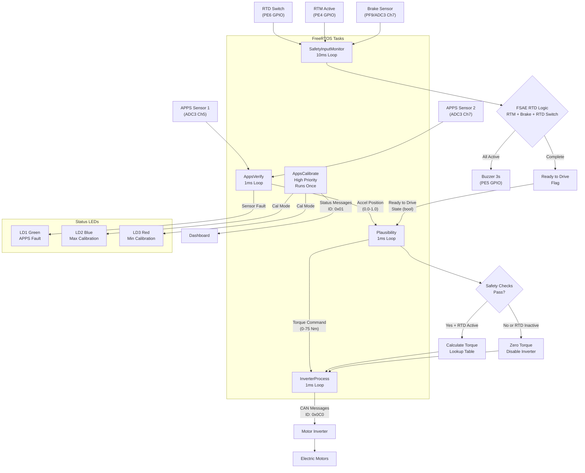

# VCU System Architecture

## Overview
The Vehicle Control Unit (VCU) is implemented using FreeRTOS on an STM32F756ZG microcontroller. The system processes Accelerator Pedal Position Sensor (APPS) inputs, performs safety checks including FSAE Ready to Drive compliance, and controls motor inverters via CAN bus communication.

## FreeRTOS Tasks

### 1. AppsCalibrate Task
- **Priority**: High
- **Execution**: Runs once at startup, then self-deletes
- **Function**: Calibrates minimum and maximum values for APPS sensors
- **Outputs**: Calibration status to dashboard via CAN (ID: 0x01)

### 2. AppsVerify Task
- **Priority**: Normal
- **Period**: 1ms loop
- **Function**: Reads dual APPS sensors, validates data, calculates accelerator position
- **Outputs**: `global_accel_position` (0.0-1.0 range)

### 3. Plausibility Task
- **Priority**: Normal  
- **Period**: 1ms loop
- **Function**: Performs safety checks and torque mapping
- **Safety Checks**: 
  - Dual pedal press detection (APPS + Brake)
  - FSAE Ready to Drive validation
- **Outputs**: `global_torque_command` (0-75 N⋅m)

### 4. InverterProcess Task  
- **Priority**: Normal
- **Period**: 1ms loop
- **Function**: Sends torque commands to motor inverter via CAN
- **CAN ID**: 0x0C0

### 5. SafetyInputMonitor Task
- **Priority**: Normal
- **Period**: 10ms loop
- **Function**: Monitors FSAE safety inputs and implements Ready to Drive system
- **Inputs**: RTD Switch (PE6), RTM Active (PE4), Brake Sensor (PF9/ADC3)
- **Outputs**: Buzzer Control (PE5), Ready to Drive flag
- **FSAE Logic**: RTM Active + Brake Pressed + RTD Switch → 3s Buzzer + Ready to Drive

## Signal Flow Diagram

## ADC Channel Allocation

| ADC | Channel | Function | Status |
|-----|---------|----------|--------|
| ADC1 | Channel 5 | Brake Sensor 1 (Legacy) | Partially Implemented |
| ADC1 | Channel 6 | Brake Sensor 2 (Legacy) | Partially Implemented |
| ADC1 | Channel 8 | Reserved (Onboard LED) | Reserved |
| ADC1 | Channel 9 | Reserved | Unused |
| ADC1 | Channel 10 | Reserved | Unused |
| ADC2 | Channel 13 | Reserved | Unused |
| ADC3 | Channel 5 | APPS Sensor 1 | **Implemented** |
| ADC3 | Channel 7 | APPS Sensor 2 | **Implemented** |
| ADC3 | Channel 7 | Brake Sensor (PF9) | **Implemented** |

## GPIO Pin Allocation

| Port | Pin | Function | Direction | Status |
|------|-----|----------|-----------|--------|
| PE4 | GPIO | RTM Active | Input (Pull-up) | **Implemented** |
| PE5 | GPIO | Buzzer Active | Output | **Implemented** |
| PE6 | GPIO | RTD Switch | Input (Pull-up) | **Implemented** |
| PF9 | ADC3_IN7 | Brake Sensor | ADC Input | **Implemented** |

## CAN Bus Communication

### Outgoing Messages
- **ID 0x01**: Calibration status from AppsCalibrate task
- **ID 0x0C0**: Torque commands from InverterProcess task

### Message Format (ID 0x0C0)
- Byte 0-1: Torque command (scaled)
- Byte 2-7: Reserved/additional data

## FSAE Safety System

### Ready to Drive Logic
The system implements FSAE compliance for "Ready to Drive" state:

1. **Condition Check**: RTM Active + Brake Pressed + RTD Switch
2. **Buzzer Sequence**: 3-second buzzer activation (PE5)
3. **Ready to Drive**: Flag set after buzzer completion
4. **Safety Override**: RTM Active loss or RTD Switch OFF immediately disables Ready to Drive

### State Machine
- **IDLE**: Waiting for all conditions
- **BUZZER_ACTIVE**: 3-second buzzer sequence
- **READY_TO_DRIVE**: System ready for operation

### Integration with Plausibility
The Ready to Drive flag is checked in the plausibility system:
- If `global_ready_to_drive` is false → Zero torque, disable inverter
- If `global_ready_to_drive` is true → Normal operation allowed

## Safety Features

### Dual Sensor Validation
- APPS uses two independent sensors for fault detection
- Cross-correlation prevents single-point failures

### Plausibility Checks
- Prevents simultaneous accelerator and brake activation
- FSAE Ready to Drive compliance check
- Real-time inverter enable/disable based on safety state

### Signal Debouncing
- All digital inputs use 3-reading debounce algorithm
- Prevents false triggering from electrical noise

### Error Handling
- ADC conversion timeouts return safe default values
- GPIO read failures default to safe states
- State machine includes invalid state recovery

## Task Communication

### Global Variables
- `global_accel_position`: Accelerator position (0.0-1.0)
- `global_torque_command`: Torque command (0-75 N⋅m)
- `global_ready_to_drive`: FSAE Ready to Drive flag
- `global_rtd_button_state`: RTD Switch state
- `global_rtm_active_state`: RTM Active state  
- `global_brake_pressed`: Brake sensor state

### Thread Safety
- All global variables declared `volatile`
- 10ms task period prevents race conditions
- Atomic boolean operations for safety flags

## Performance Characteristics

- **APPS Response Time**: <1ms (1ms task period)
- **Safety Check Latency**: <1ms (plausibility task)
- **CAN Message Rate**: 1000 Hz (1ms inverter task)
- **FSAE RTD Detection**: <30ms (3x 10ms debounce)
- **Buzzer Duration**: 3000ms (FSAE compliance)

## Hardware Requirements

- STM32F756ZG microcontroller
- ADC3 channels 5, 7 for APPS sensors
- ADC3 channel 7 for brake sensor (PF9)
- GPIO PE4, PE5, PE6 for FSAE system
- CAN transceiver for motor communication

